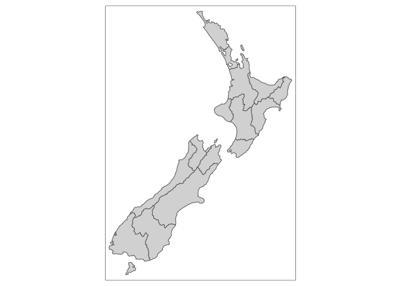

README
================
Jennifer Chang
11/16/2020

## ANALYSIS NAME with MapDeck

**More Information**

-   Tutorial: [link
    here](https://geocompr.robinlovelace.net/adv-map.html)
-   tmap tutorial: [link
    here](https://cran.r-project.org/web/packages/tmap/vignettes/tmap-getstarted.html)
-   PubMed Central: [list of articles that mention
    “mapdeck”](https://www.ncbi.nlm.nih.gov/pmc/?term=%22mapdeck%22+geospatial)

## Installation

``` r
library(sf)
#> Linking to GEOS 3.8.1, GDAL 3.1.1, PROJ 6.3.1
library(raster)
#> Loading required package: sp
library(dplyr)
#> 
#> Attaching package: 'dplyr'
#> The following objects are masked from 'package:raster':
#> 
#>     intersect, select, union
#> The following objects are masked from 'package:stats':
#> 
#>     filter, lag
#> The following objects are masked from 'package:base':
#> 
#>     intersect, setdiff, setequal, union
library(spData)
library(spDataLarge)

library(tmap)
library(leaflet)
library(ggplot2)
```

## Demo run

``` r
tm_shape(nz) +
  tm_fill() +
  tm_borders()
```

<!-- -->

<hr/>

## Scrap after this

This is an R Markdown document. Markdown is a simple formatting syntax
for authoring HTML, PDF, and MS Word documents. For more details on
using R Markdown see <http://rmarkdown.rstudio.com>.

When you click the **Knit** button a document will be generated that
includes both content as well as the output of any embedded R code
chunks within the document. You can embed an R code chunk like this:

``` r
summary(cars)
#>      speed           dist       
#>  Min.   : 4.0   Min.   :  2.00  
#>  1st Qu.:12.0   1st Qu.: 26.00  
#>  Median :15.0   Median : 36.00  
#>  Mean   :15.4   Mean   : 42.98  
#>  3rd Qu.:19.0   3rd Qu.: 56.00  
#>  Max.   :25.0   Max.   :120.00
```

## Including Plots

You can also embed plots, for example:

<!-- -->

Note that the `echo = FALSE` parameter was added to the code chunk to
prevent printing of the R code that generated the plot.
